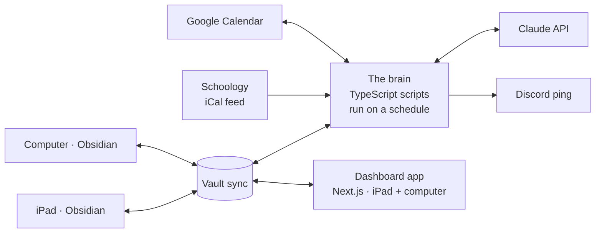

# School OS roadmap

A personal, agent-driven study system built on top of Obsidian. You take notes on
your iPad and computer; a background agent sorts them into courses and units,
turns them into flashcards, practice tests and unit reviews, watches your
Schoology calendar for tests, and books study sessions into your Google Calendar.
A separate dashboard app is where you actually go to study: it shows every note
organized by course and unit, upcoming tests, the study schedule, and a
notification feed, so Obsidian is only where notes get written.

This document is the plan. It is written so each phase is one small script you
can build, test and use before starting the next one.

---

## 1. The one-paragraph version

Obsidian is the note app and the database. Every note is a markdown file in a
vault that syncs between iPad and computer. A set of small TypeScript scripts
("the brain") read that vault, call Claude, and write back: frontmatter, moved
files, generated study material, and a notification feed. Two feeds come in
from outside: Schoology's calendar (as an iCal URL) and your Google Calendar
(through the Calendar API). One feed goes out: study blocks written to a
dedicated "Study" Google Calendar, plus a Discord ping when a test is posted.
On top of all that sits the dashboard app, a Next.js site you open on the iPad
and computer. It reads the same vault and is the place you browse notes, study
for a test, and see what is coming up.



Three layers, three jobs:

| Layer | Job | You touch it when |
|---|---|---|
| Obsidian | Writing notes | In class, doing homework |
| The brain | Sorting, generating, watching, scheduling | Never. It runs on its own |
| Dashboard app | Browsing, studying, seeing what is due | Studying for a test, checking the week |

---

## 2. Decisions and why

| Decision | Choice | Why |
|---|---|---|
| Note app | **Obsidian** on iPad and computer | Real apps on both devices already exist. Notes are plain markdown files, so scripts can read and write them without an API. Plugins cover flashcards and templates. You do not build a note app. |
| Storage | **The vault folder is the database** | No server, no schema migrations. Frontmatter on each note holds the metadata the agent needs. |
| Sync | **Obsidian Sync** (paid) or **iCloud** if the computer is a Mac | The brain needs the vault on the machine it runs on. Obsidian Sync is the reliable cross-platform option. iCloud works well Mac-to-iPad and badly on Windows. |
| Handwriting | **Typed notes first**, handwriting ingestion in Phase 7 | Obsidian has no native handwriting. Apple Pencil Scribble types into it fine. Later, handwritten pages from GoodNotes or Notability can be exported as PDF into the inbox and read by Claude vision. |
| The brain | **TypeScript scripts** in a `school-os/` folder or a new repo | Same language and tooling as this repo. Each job is one file. |
| Where it runs | **Your computer** in Phases 1 to 4, **GitHub Actions cron** in Phase 6 | Start with `npm run sort` by hand. Move to always-on only when it hurts. |
| Model | `claude-opus-5` with structured outputs | Sorting and generation both need reliable JSON. Structured outputs give you a typed result instead of parsing prose. |
| Dashboard | **A Next.js app that reads the vault** | Obsidian is confusing to navigate, so studying happens somewhere else. The app shows notes by course and unit, a study page per test, upcoming assessments, the study schedule and a notification feed. Until it exists (Phase 5), `Home.md` in the vault is the stand-in. |
| Schoology | **iCal feed URL** | Schoology exposes a calendar feed per user (Calendar → Export). No developer key, no admin approval. |
| Google Calendar | **Service account** with your calendar shared to it | Avoids the OAuth consent screen and the seven-day token expiry that hits unverified personal apps. |
| Notifications | **`notifications.json` in the vault, plus a Discord webhook** | The JSON file is the record the dashboard app shows with an unread badge. Discord is the ping; this repo's alerts tool already posts there. |

Two rules the brain always follows:

1. **It never edits the body of a note you wrote.** It only changes frontmatter,
   moves files, and writes to generated files.
2. **Everything it creates is marked as its own**, so it can regenerate or delete
   its work without touching yours. Notes get `sorted_by: agent`; calendar
   events get a `[school-os:<id>]` tag in the description.

---

## 3. Vault layout

```
Vault/
  00 Inbox/                      every new note starts here, on any device
  01 Courses/
    AP Biology/
      _Course.md                 course card: teacher, period, unit list, study rules
      Unit 03 - Cells/
        _Unit.md                 unit map, maintained by the brain
        2026-09-03 Cell membrane lecture.md
    AP US History/
      ...
  02 Study/
    Flashcards/                  one deck file per unit
    Practice Tests/
    Unit Reviews/
  03 Calendar/
    Upcoming Tests.md            generated from Schoology
    Study Plan.md                generated from the planner
  04 System/
    Home.md                      dashboard
    Needs Review.md              notes the brain was unsure about
    study-rules.md               your constraints for the planner
    agent-log.md                 what the brain did and when
    notifications.json           feed the dashboard app shows
    schoology-state.json         what the brain has already seen on Schoology
  _templates/
```

Frontmatter the brain writes on every sorted note:

```yaml
---
course: AP Biology
unit: Unit 03 - Cells
type: lecture          # lecture | reading | homework | lab | review
date: 2026-09-03
topics: [cell membrane, osmosis, active transport]
sorted_by: agent
confidence: 0.92
status: organized      # raw | organized | reviewed
---
```

One Obsidian setting matters here. Set **Files & Links → New link format** to
"Shortest path when possible". The brain moves files from outside Obsidian, and
basename links keep working after a move. Full-path links break.

`_Course.md` is where you tell the brain about a course:

```yaml
---
course: AP Biology
teacher: Ms. Rivera
period: 3
units:
  - Unit 01 - Chemistry of Life
  - Unit 02 - Cell Structure
  - Unit 03 - Cells
study_hours:
  quiz: 1.5
  test: 4
  final: 8
---
```

The brain reads every `_Course.md` to learn which courses and units exist, so
adding a unit is just editing that list.

---

## 4. The brain's jobs

Each job is one script. They share a small `vault.ts` helper that lists files,
reads and writes frontmatter, and moves notes.

### `sort-inbox`

Runs every 15 minutes (or by hand). For each note in `00 Inbox/` with
`status: raw` or no frontmatter:

1. Send Claude the note body plus the list of courses and units from every
   `_Course.md`.
2. Ask for a structured result: course, unit, type, date, topics, confidence,
   and a one-line reason.
3. If confidence is at or above 0.7, write the frontmatter, move the file into
   the unit folder, and append a link to `_Unit.md`.
4. If below 0.7, leave it in the inbox, set `status: needs-review`, and list it
   in `Needs Review.md` with the reason. You fix those by hand; that is how you
   catch a bad guess before it spreads.

A note about the same lecture written on two days stays as two notes. The unit
map links both. Merging is a later problem, if it ever becomes one.

### `generate-study`

Triggered by a tag you put in any note or unit map, from either device:

| Tag | Output |
|---|---|
| `#make-flashcards` | `02 Study/Flashcards/<Course> - <Unit>.md` in Spaced Repetition plugin format |
| `#make-test` | `02 Study/Practice Tests/<Course> - <Unit> - Test N.md` |
| `#make-review` | `02 Study/Unit Reviews/<Course> - <Unit>.md` |

The brain gathers every note in that unit, generates the material, writes the
file, and removes the tag. Tags work from iPad, which desktop-only plugins like
Shell Commands do not.

Flashcards use the Obsidian **Spaced Repetition** plugin's format so you can
review them on the iPad with real spaced repetition:

```markdown
#flashcards/ap-biology/unit-03

What does the sodium-potassium pump move, and in which directions?::3 Na+ out, 2 K+ in, per ATP.

Osmosis is the diffusion of what, across what?
?
Water, across a selectively permeable membrane.
```

Practice tests put each answer in a collapsed callout so you can attempt the
question first:

```markdown
**3.** A cell is placed in a hypertonic solution. What happens and why?

> [!answer]- Answer
> Water leaves the cell by osmosis; the cell shrinks (crenation in animal cells, plasmolysis in plant cells).
```

Grading a practice test is a second tag: `#grade-me` on a test where you typed
your answers under each question. The brain scores it, writes feedback, and
notes weak topics on the unit map.

### `sync-schoology`

Runs every 30 minutes.

1. Fetch the iCal feed. Parse it with the `ical.js` or `node-ical` package.
2. Diff against `04 System/schoology-state.json` to find new or changed items.
3. Ask Claude to classify each new item: test, quiz, project, homework, other.
   Teachers name things inconsistently, so a keyword match is not enough.
4. Rewrite `Upcoming Tests.md` sorted by date, with course and days remaining.
5. Post a Discord message for any new test or quiz.

The feed only contains what teachers actually post. That is a real limit and
there is no way around it from the calendar side. If your school has turned the
feed off, the fallback is Schoology's email notifications: forward them to a
Gmail label and have the script read that label instead.

### `plan-study`

Runs nightly and after every `sync-schoology` that found a new assessment.

1. For each upcoming assessment, work out target hours from the course's
   `study_hours` table, scaled a little by how many notes the unit has.
2. Read `study-rules.md` for your constraints. Example:

   ```markdown
   - Weekdays: 4:00pm to 9:30pm
   - Saturday: 10am to 6pm
   - Sunday: 12pm to 8pm
   - Never on Friday after 6pm
   - Max 2 hours of study per day, sessions of 45 minutes
   - Keep 30 minutes between a study block and anything already on the calendar
   ```

3. Read free/busy from your Google Calendar for the window between now and the
   assessment.
4. Place sessions. Spread them rather than cramming: at least one session early,
   more weight in the last three days.
5. Write each session to the **Study** calendar with a description like
   `Review: AP Biology Unit 03 flashcards + practice test 1 [school-os:abc123]`.
6. Rewrite `Study Plan.md` as a week view.

Rerunning must not create duplicates. Before placing sessions for an
assessment, the script deletes every event in the Study calendar tagged with
that assessment's id, then places fresh ones. Only events with the tag are ever
touched.

### `build-home`

Runs after every other job. Rewrites `Home.md`: next three assessments, today's
study sessions, notes sorted in the last 24 hours, anything in Needs Review,
and decks due for review.

It also appends to `04 System/notifications.json`, which the dashboard app
reads as its notification feed. One entry per event, newest first:

```json
{
  "id": "n_0042",
  "time": "2026-09-03T15:10:00-04:00",
  "kind": "test_posted",
  "title": "AP Biology: Unit 3 test on Oct 14",
  "link": "03 Calendar/Upcoming Tests.md",
  "read": false
}
```

Kinds: `test_posted`, `assignment_posted`, `notes_sorted`, `needs_review`,
`study_generated`, `session_today`, `deck_due`. The Discord ping is the same
event sent one more place; the JSON file is the record.

---

## 5. Phases

Each phase has a "done when" you can check. Do not start the next phase until
the current one is done and you have used it for real school work.

### Phase 0 · Vault and sync (week 1, no code)

- Create the vault with the layout in section 3. Add one `_Course.md` per class.
- Install Obsidian on iPad and computer. Set up Obsidian Sync or iCloud.
- Install plugins: Templater, Dataview, Spaced Repetition. Set the link format
  setting above.
- Make a note template that drops a new note in `00 Inbox/` with today's date
  in the filename.
- Take every class note in Obsidian for a week.

**Done when:** a note typed on the iPad shows up on the computer within a
minute, and you have at least 15 real notes in the inbox.

### Phase 1 · Sort the inbox (weeks 2 to 3)

- Set up `school-os/` as a small TypeScript project: `@anthropic-ai/sdk`,
  `gray-matter` for frontmatter, `zod` for the result schema.
- Write `vault.ts`: list markdown files, read and write frontmatter, move a
  file, append a line to `_Unit.md`.
- Write `sort-inbox.ts` using `client.messages.parse()` with a Zod schema so the
  result is typed.
- Add a `--dry-run` flag that prints what it would do without touching files.
  Use it on the 15 notes from Phase 0 before letting it move anything.

**Done when:** 20 real notes sorted with two or fewer manual corrections, and
`Needs Review.md` catches the ambiguous ones rather than misfiling them.

### Phase 2 · Study material (weeks 4 to 5)

- Write `generate-study.ts` handling the three tags.
- Get one full unit to have a flashcard deck, a practice test, and a unit
  review.
- Add `#grade-me`.

**Done when:** you have reviewed a generated deck on the iPad with the Spaced
Repetition plugin, taken a generated practice test, and the grading feedback
named at least one weak topic you agreed with.

### Phase 3 · Schoology feed (week 6)

- Copy your Schoology calendar feed URL into `.env`.
- Write `sync-schoology.ts` with the state file and Discord webhook.
- Keep the classifier prompt short and give it three or four real examples of
  how your teachers phrase things.

**Done when:** a test a teacher posts appears in `Upcoming Tests.md` and on
Discord within 30 minutes, and rerunning the script does not re-announce it.

### Phase 4 · Study planner (weeks 7 to 8)

- In Google Cloud Console: create a project, enable the Calendar API, create a
  service account, download its key. In Google Calendar: create a "Study"
  calendar and share both it and your main calendar with the service account's
  email ("make changes to events" on Study, "see all event details" on main).
- Write `plan-study.ts`. Start with the placement rules in section 4 and keep
  the algorithm boring. Rules you can read beat a clever scheduler you cannot
  debug.
- Write `build-home.ts`.

**Done when:** study blocks for a real upcoming test appear in Google Calendar
on your phone, they respect `study-rules.md`, and running the planner twice in
a row changes nothing.

### Phase 5 · Dashboard app (weeks 9 to 12)

This is the part you will open every day. It is a Next.js app, the same stack
and Tailwind setup as this repo, that reads the vault and presents it in a way
Obsidian does not. Obsidian stays the writing tool; the app is the reading and
studying tool.

Runs on your computer first with `VAULT_PATH` pointing at the synced vault
folder. Open it on the iPad over home wifi at the computer's local address.
Phase 6 moves it to Vercel so it works anywhere.

**Screens, in build order:**

1. **Home.** Big countdown cards for the next three assessments, today's study
   sessions with what to review in each, a notification feed with an unread
   badge, and a row of course tiles. This screen replaces `Home.md`.
2. **Notes browser.** Left rail: courses, then units. Main area: notes as cards
   with date, type and topics, sortable by date or type, filterable by a
   search box that matches titles, topics and body text. Click a note to read
   it rendered as HTML, with `[[wikilinks]]` turned into links. This is where
   you go to find notes for homework.
3. **Study page.** One page per upcoming assessment: `/study/<assessment id>`.
   It gathers everything for that unit in tabs: Notes, Unit review, Flashcards,
   Practice tests. Flashcards flip in the browser. Practice tests hide answers
   until you reveal them. Buttons at the top write the `#make-flashcards`,
   `#make-test` and `#make-review` tags into the unit map, so generating new
   material is one tap and the brain does the rest.
4. **Week view.** Seven columns merging Google Calendar events, study blocks,
   and assessment dates. Study blocks link to their study page.
5. **Notifications.** Full list from `notifications.json`, mark as read,
   filter by kind.

**How it reads and writes:**

- Route handlers in `app/api/` read the vault with `gray-matter` and build an
  index once per minute: every note's frontmatter, path and first 300
  characters. Pages query that index, never the disk directly.
- Markdown renders with `react-markdown`. A small regex turns
  `[[Note name]]` into a link to `/note/<path>`.
- Writes are limited to adding a tag line to a note and flipping `read` in
  `notifications.json`. The app never edits note bodies for the same reason
  the brain does not.
- Make it a PWA with an app manifest so it installs to the iPad home screen
  like a native app and opens full screen.

**Look and feel.** Dark theme by default, one accent color per course carried
through cards, countdowns and the week view, big numbers on countdowns, and
nothing on the home screen that is not about the next seven days. The
`design-taste-frontend` skill in this repo is the guide for getting it past
"template" quality.

**Done when:** you study for a real test using only the app, from the iPad,
without opening Obsidian once. Notes, flashcards, practice test and the week
view all came from the same screen.

### Phase 6 · Always on and deployed (week 13 onward)

Until now the brain only runs when your computer runs it, and the dashboard
only works at home. Pick one for the brain:

- **Option A, a spare machine.** An old laptop or Mac mini left on, with the
  vault synced to it and the scripts on a `cron` or Task Scheduler entry every
  15 minutes. Simplest if you have the hardware.
- **Option B, GitHub Actions.** Put the vault in a private GitHub repo. Install
  the Obsidian Git plugin on both devices set to auto-commit and auto-pull. A
  workflow on a 15-minute cron checks out the vault, runs the scripts with your
  API keys as repository secrets, and commits the result. No hardware, no
  server. Obsidian Git on iPad is slower than desktop but fine for a text-only
  vault.
- **Option C, a scheduled cloud agent.** A Claude Managed Agents scheduled
  deployment operating on the same git-synced vault. Same idea as B with the
  agent loop hosted by Anthropic; worth looking at once B is working and you
  want the brain to do open-ended tasks rather than fixed scripts.

Then deploy the dashboard. With Option B the vault is already a GitHub repo,
so the app on Vercel reads notes through the GitHub API with a token in its
environment, caching the index for a minute. The app's two writes (tags and
read flags) become commits. Add web push so a new test posted on Schoology
shows up as a notification on the iPad; iOS supports push for installed PWAs.
Put a login in front of it, since it is your schoolwork on a public URL.

**Done when:** you take notes only on the iPad for a whole school day, they
are sorted by the time you sit down at the computer, and you can open the
dashboard from school wifi and see them.

### Phase 7 · Optional extensions

- **Handwriting ingestion.** Export a GoodNotes or Notability page as PDF into
  `00 Inbox/`. The sorter sends it to Claude as a document block, gets markdown
  back, saves it as a note next to the PDF, and sorts that note.
- **Anki export.** Same flashcard content, written through AnkiConnect for
  people who prefer Anki's app.
- **Calibrated study hours.** After each test, record the grade in `_Unit.md`.
  The planner nudges that course's `study_hours` up or down over time.
- **In-app spaced repetition.** Store card review history in the app so
  flashcard scheduling lives there instead of the Obsidian plugin.
- **Voice notes.** Record a lecture on the iPad, transcribe it, drop the
  transcript in the inbox.

---

## 6. Stack summary

| Piece | Tool |
|---|---|
| Notes | Obsidian, plugins: Templater, Dataview, Spaced Repetition, Obsidian Git (Phase 6) |
| Sync | Obsidian Sync or iCloud, then a private GitHub repo in Phase 6 |
| Language | TypeScript on Node, same as this repo |
| Claude | `@anthropic-ai/sdk`, model `claude-opus-5`, `client.messages.parse()` with Zod schemas, adaptive thinking on |
| Frontmatter | `gray-matter` |
| Schoology | `node-ical` reading the personal feed URL |
| Google Calendar | `googleapis` package with a service account |
| Notifications | `notifications.json` in the vault, shown in the app; Discord webhook as the ping, web push in Phase 6 |
| Dashboard app | Next.js and Tailwind like this repo, `react-markdown`, PWA manifest, Vercel in Phase 6 |
| Scheduling | By hand, then cron or Task Scheduler, then GitHub Actions |

### Rough API cost

Estimated, not measured. Assumes 30 notes sorted per school day at around 4k
input and 500 output tokens each, plus a few study-material generations per
week at around 20k in and 5k out.

| Job | Per run | Per month (school in session) |
|---|---|---|
| Sort a note | about $0.03 | about $20 |
| Flashcards, test, or review for a unit | about $0.25 | about $5 |
| Schoology classification | under $0.01 | under $1 |
| Planner | no model call | $0 |

Prompt caching on the course list and the long system prompt cuts the sorting
figure further. Measure with `response.usage` once Phase 1 is running and
replace this table.

---

## 7. Things that will bite, and the plan for each

- **Teachers who do not post tests.** The feed cannot announce what was never
  posted. Keep a `#test-on 2026-10-14` tag you can add to any note from class;
  the sorter turns it into an assessment the planner sees.
- **Sorting confidence.** Early on the brain will misfile notes that mention
  two courses. The threshold and `Needs Review.md` exist for this. Lower the
  threshold only after a month of clean sorting.
- **Moving files breaks links.** Only if links use full paths. Set the link
  format before Phase 1 and the problem never appears.
- **Desktop-only plugins.** Shell Commands and most automation plugins do not
  run on iPad. Every trigger in this plan is a tag or a schedule for that
  reason.
- **Google OAuth expiry.** Personal OAuth apps left in "testing" lose their
  refresh tokens weekly. The service account route sidesteps it entirely.
- **School Google accounts.** Many districts block third-party apps on school
  accounts. Use a personal Google account for the Study calendar and subscribe
  to it from the school account if needed.
- **Obsidian Git on a big vault.** Slows down with thousands of files or
  large PDFs. Keep PDFs out of the git-synced vault or add them to
  `.gitignore` and sync them another way.
- **Code size.** Each phase is deliberately one script of roughly 100 to 200
  lines. If a script is growing past that, split a job out rather than adding
  flags. The learn-mode skill in this repo can walk through each script as it
  is written.

---

## 8. This week

1. Create the vault and folders. Add `_Course.md` for each class.
2. Install Obsidian on both devices and pick a sync method.
3. Install the three plugins and set the link format.
4. Take all your notes in `00 Inbox/` for the rest of the week.
5. Find your Schoology calendar feed URL and confirm it opens. If it does not
   exist, note that now so Phase 3 uses the email fallback.
6. Decide whether `school-os/` lives in this repo or its own. A separate repo
   keeps it apart from the sports card and clothing tools.
